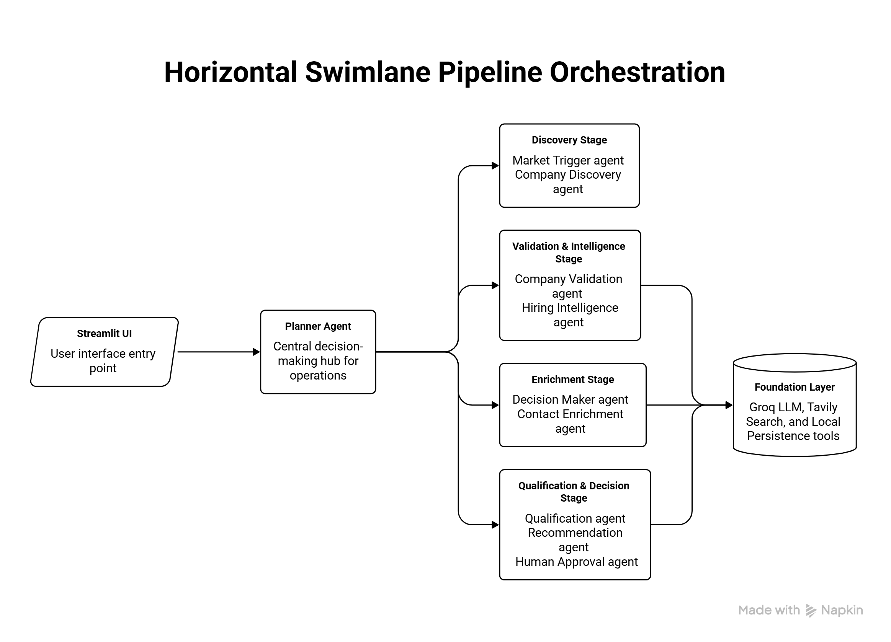

# Agentic Staffing Platform

## 1. Problem Statement

Staffing and recruiting agencies generate new business by finding companies that are actively hiring and reaching out before competitors do. Today, this process is largely manual: a business development representative scans job boards, company news, LinkedIn, and press releases, then manually decides whether a company is worth pursuing as a client.

The **Agentic Staffing Platform** automates company-level lead discovery and qualification for staffing sales teams.

> **Note:** This is **not** a job search platform. Job postings are treated only as **input signals**, never as the final output.

The platform produces a ranked list of companies, each containing:

- Hiring intelligence
- Qualification score
- Company insights
- Decision-maker information (when available)
- Recommended outreach strategy

---

# 2. System Architecture

The platform is built as a **multi-agent AI system** using **LangGraph**. Rather than relying on a single prompt or a fixed workflow, a **Planner Agent** dynamically decides which specialized agent should execute next based on the current research state.

## Agent Workflow



## Agent Responsibilities

### Planner Agent
- Dynamically orchestrates all agents.
- Determines the next execution step using LangGraph's `Command(goto=...)` routing.

### Market Trigger Agent
- Detects hiring signals such as:
  - Funding announcements
  - Expansion news
  - Acquisitions
  - Rapid hiring

### Company Discovery Agent
- Discovers potential client companies.
- Uses market signals and web search.
- Focuses on companies rather than individual job postings.

### Company Validation Agent
- Verifies company existence.
- Checks whether the company matches the Ideal Customer Profile (ICP).
- Removes invalid or duplicate companies.

### Hiring Intelligence Agent
- Estimates hiring demand.
- Identifies technical hiring volume.
- Detects hiring trends.
- Measures staffing opportunities.

### Company Enrichment Agent
- Collects:
  - Industry
  - Employee count
  - Headquarters
  - Funding stage
  - Company description
  - Recent growth signals

### Decision Maker Agent
- Identifies hiring decision-makers such as:
  - Head of Talent Acquisition
  - HR Director
  - VP Engineering
  - CTO

### Contact Enrichment Agent
- Attempts to enrich:
  - Corporate email
  - Phone number
  - LinkedIn profile

### Qualification Agent
- Scores companies using configurable staffing qualification rules.
- Generates qualification reasoning.

### Recommendation Agent
- Produces:
  - Staffing priority
  - Recommended outreach
  - Business rationale

### Human Approval Agent
- Allows users to:
  - Approve prospects
  - Reject prospects
  - Review recommendations before final storage

---

# 3. Technology Stack

- **Python**
  - Core programming language.

- **LangGraph**
  - Multi-agent orchestration.
  - Dynamic Planner Agent routing.

- **Groq (Llama 3.3 70B Versatile)**
  - Large Language Model used by all agents.

- **Tavily Search API**
  - Company discovery.
  - Validation.
  - Market research.

- **Streamlit**
  - Multipage web application.
  - User interface.

- **Local JSON Storage**
  - Stores approved and rejected companies.

---

# 4. Features

- Dynamic Planner-based Agent Orchestration
- Multi-Agent AI Architecture
- Configurable Ideal Customer Profile (ICP)
- Hiring Signal Detection
- Company Discovery
- Company Validation
- Hiring Intelligence Analysis
- Company Enrichment
- Decision Maker Identification
- Contact Enrichment
- Lead Qualification
- AI-Powered Outreach Recommendations
- Human-in-the-Loop Approval
- Persistent Lead Storage

---

# 5. Installation

## Prerequisites

- Python 3.10 or above
- Groq API Key
- Tavily API Key

## Clone Repository

```bash
git clone <repository-url>
cd <repository-name>
```

## Create Virtual Environment

### Windows

```bash
python -m venv venv
venv\Scripts\activate
```

### Linux/macOS

```bash
python -m venv venv
source venv/bin/activate
```

## Install Dependencies

```bash
pip install -r requirements.txt
```

## Configure Environment Variables

Create a `.env` file.

```env
GROQ_API_KEY=your_groq_api_key
TAVILY_API_KEY=your_tavily_api_key
```

---

# 6. Running the Application

Navigate to the UI folder.

```bash
cd ui
```

Run the Streamlit application.

```bash
streamlit run app.py
```

---

# 7. Project Structure

```text
.
├── agents/
├── config/
├── core/
├── data/
├── tests/
├── ui/
├── README.md
├── requirements.txt
└── run_cli.py
```

---

# 8. Platform Highlights

- Planner-driven orchestration
- Modular agent architecture
- Shared memory between agents
- Human-in-the-loop approval
- Configurable business rules
- Company-centric staffing intelligence
- Easily extensible to new B2B use cases

---

# 9. Future Enhancements

- LinkedIn integration
- CRM integrations (Salesforce, HubSpot)
- Email automation
- ML-based lead scoring
- PostgreSQL database
- Docker deployment
- Kubernetes support
- Multi-tenant architecture
- Support for additional B2B domains